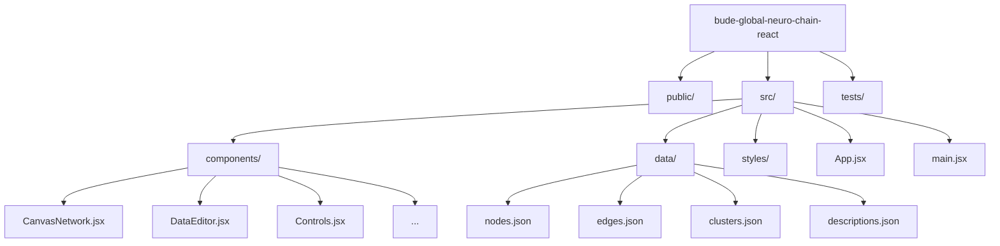

# Bude Global Neuro-Chain

English | [தமிழ்](./i18n/README_TA.md) | [हिन्दी](./i18n/README_HI.md) | [简体中文](./i18n/README_CN.md) | [Español](./i18n/README_SP.md)

> **From Primitive Fire to Universal Intelligence: The Neural Blueprint of Human Ingenuity**
> **Innovation Network Visualization Platform**

[](https://reactjs.org/) [](https://vitejs.dev/) [](https://d3js.org/) [](https://www.typescriptlang.org/) [](https://opensource.org/licenses/gpl-3.0) [](https://invent.budeglobal.in/) [](https://github.com/BUDEGlobalEnterprise/bude-global-neuro-chain-react) [](https://github.com/BUDEGlobalEnterprise/bude-global-neuro-chain-react/issues) [](https://github.com/BUDEGlobalEnterprise/bude-global-neuro-chain-react/issues?q=is%3Aissue+label%3A%22good+first+issue%22)

<p align="center">
  <a href="https://github.com/BUDEGlobalEnterprise/bude-global-neuro-chain-react/stargazers">
    
  </a>
  <a href="https://github.com/BUDEGlobalEnterprise/bude-global-neuro-chain-react/network">
    
  </a>
</p>

**[→ Explore the live demo](https://invent.budeglobal.in/)**

Interactive visualization of human innovation as a non-linear network, showing how technologies build upon each other from fire to AGI. Powered by Bude Global.


## 🚀 Latest Upgrades: "Iron Man" Tier Interaction

The platform now features a professional-grade gesture interaction layer, allowing users to navigate the universe of innovation with cinematic precision.

| Zero-Lag Precision                                                 | Futuristic HUD                                 |
| :----------------------------------------------------------------- | :--------------------------------------------- |
|  |   |
| _Off-main-thread processing via Web Workers_                       | _Real-time landmark tracking & scanning lines_ |

### Key Interaction Features:

- **Zero-Touch Navigation**: Pan, Zoom, and Rotate the 3D network with simple hand signs.
- **Dynamic LOD (Level of Detail)**: Intelligent rendering simplification during active movement for 60FPS thread safety.
- **Background Intelligence**: MediaPipe hand-tracking and gesture detection offloaded to a dedicated **Web Worker**.
- **Cinematic Feedback**: High-tech HUD with scanning effects, lock-on crosshairs, and spatial ripples on intent execution.

---

## 📊 Live Network Statistics

- **715 Innovations** from primitive tools to AGI.
- **1,817 Connections** showing technological dependencies.
- **9 High-Density Clusters** (Computing, Medicine, Energy, etc.)
- **2.5 Density Factor** representing the complexity of human ingenuity.

---

## 📋 Table of Contents

- [Community](#community)
- [Inspiration](#inspiration)
- [About Bude Global](#about-bude-global)
- [What This Is](#what-this-is)
- [Why It Matters](#why-it-matters)
- [Features](#features)
- [Core Features](#core-features)
- [Getting Started](#getting-started)
- [Project Structure](#project-structure)
- [How to Use](#how-to-use)
- [Data Schema](#data-schema)
- [Contributing](#contributing)
- [Deployment](#deployment)
- [The Neuro-Chain Model](#the-neuro-chain-model)
- [Technical Notes](#technical-notes)
- [Acknowledgments](#acknowledgments)
- [License](#license)

## Community

This project is part of a broader effort to rethink how we learn, build, and share knowledge.

- **💬 Join the conversation** — [WhatsApp Community](https://chat.whatsapp.com/JSa5qnGbqAE76DEav1KCK6)
- **🌍 Community hub** — [budeglobal.in/community](https://www.budeglobal.in/community)
- **📺 Updates and ideas** — [YouTube Channel](https://www.youtube.com/channel/UC0SOuDkpL6qpIF1o4wRhqRQ)

---

## Inspiration

This project was inspired by [_The Thinking Game_](https://www.youtube.com/watch?v=d95J8yzvjbQ), a documentary by Google DeepMind about how thinking systems — including human intelligence and AI — evolve and connect over time.

If you're interested in the philosophy behind this work, that's a good place to start.

---

## 🌟 About Bude Global

Bude Global specializes in visualizing complex innovation networks and technology dependencies. This Neuro-Chain platform demonstrates our capability to transform data into intuitive, interactive visual experiences.

---

## What This Is

Innovation doesn't happen in a straight line. Ideas connect, combine, and build on each other in ways that timelines can't capture. The wheel enables carts, carts enable trade routes, trade routes enable cultural exchange, cultural exchange sparks new ideas — and suddenly you're looking at the printing press.

This project visualizes that reality: a network where each node represents a breakthrough, discovery, or technology, and the connections show how they influenced each other across time and space.

It's a tool for exploration, learning, and rethinking how we understand progress itself.

---

## Why It Matters

We're taught to see history as a sequence of events. But innovation is a _system_ — messy, interconnected, and emergent. When you see it as a network, patterns emerge:

- How ancient tools enabled modern computing
- Why certain breakthroughs were only possible after others
- The hidden dependencies between seemingly unrelated fields
- How ideas from different cultures and eras cross-pollinate

This project makes those relationships visible. It's for anyone curious about how we got here — and where we might go next.

---

## 🚀 Features

- **Smart Search**: Real-time node search with instant camera focus
- **Pixel-Perfect Conversion**: 1:1 visual fidelity from the original HTML implementation
- **Data-Driven**: All invention data separated into JSON files for easy editing
- **Interactive Canvas**: Pan, zoom, and explore the innovation network
- **Live Data Editor**: Edit nodes, edges, clusters, and descriptions in real-time
- **Performance Optimized**: Memoization, efficient rendering, scales to 10k+ nodes
- **100% Static**: No server required, deploys anywhere
- **SEO Ready**: Comprehensive meta tags for search engines and social media
- **Mobile Responsive**: Optimized for all screen sizes
- **Gesture Control**: Zero-touch interaction using webcam hand tracking (MediaPipe)

---

## Core Features

### Visual Intelligence

- **Dynamic Signal Propagation** - Click any node to watch knowledge transmission along historical connections
- **Multi-Physics Layout Engine** - Switch between force-directed, radial, and temporal layouts in real-time
- **12 Visualization Themes** - Custom visual paradigms including Neuro, Cyberpunk, Cosmos, and Blueprint
- **Real-time Editing** - Modify nodes, edges, and clusters without restarting the application

### Data Architecture

- **JSON-Based Knowledge Graph** - Entire history stored in editable, version-controlled JSON files
- **Schema-Driven Evolution** - Extensible metadata system for temporal, geospatial, and impact analysis
- **Import/Export Standards** - Compatible with CSV, GraphML, and Neo4j formats
- **Live Data Editor** - In-browser JSON editor with validation and preview

### Performance & Scalability

- **GPU-Accelerated Rendering** - Canvas-based engine supporting 10,000+ nodes
- **Incremental Loading** - Dynamic data streaming for large historical datasets
- **Memoized Components** - React optimization for 60fps interactions
- **Zero-Dependency Core** - Self-contained physics and rendering engines

### Research Capabilities

- **Temporal Filtering** - Isolate innovations by century or technological era
- **Dependency Analysis** - Visualize forward and backward technological links
- **Impact Scoring** - Algorithmic assessment of innovation significance
- **Pathfinding Algorithms** - Discover shortest knowledge paths between domains

## Getting Started

### Prerequisites

- Node.js (v16 or higher recommended)
- npm or yarn

### Installation

```bash
# Clone the repository
git clone https://github.com/BUDEGlobalEnterprise/bude-global-neuro-chain-react.git
cd bude-global-neuro-chain-react

# Install dependencies
npm install
```

### Running Locally

```bash
# Start development server
npm run dev

# Build for production
npm run build

# Preview production build
npm run preview
```

Open your browser to `http://localhost:5173` and start exploring.

---

## Project Structure



```
bude-global-neuro-chain-react/
├── public/
├── src/
│   ├── components/          # React components
│   │   ├── CanvasNetwork.jsx
│   │   ├── TitleBlock.jsx
│   │   ├── Legend.jsx
│   │   ├── Panel.jsx
│   │   ├── ClusterView.jsx
│   │   ├── DataEditor.jsx
│   │   ├── Controls.jsx
│   │   └── Tooltip.jsx
│   ├── data/                # JSON data files
│   │   ├── clusters.json    # 9 cluster definitions
│   │   ├── nodes.json       # 78 invention nodes
│   │   ├── edges.json       # 113 connections
│   │   └── descriptions.json # Cluster descriptions
│   ├── styles/              # CSS modules
│   ├── App.jsx              # Main application
│   └── main.jsx             # Entry point
├── vite.config.js
└── package.json
```

---

## How to Use

### Navigation

- **Mouse drag** — pan around the canvas
- **Mouse wheel** — zoom in and out
- **Hover over nodes** — see tooltips with details
- **Click legend items** — focus on specific clusters
- **⟲ button** — reset view to origin
- **⏸/▶ button** — pause/resume animation
- **↓ button** — export all data as JSON
- **📹 button** — toggle camera preview for Gesture Control
- **Gesture Status** — click the status badge to open the "How it Works" guide

### Editing Data

The right panel includes a live data editor where you can:

1. Select any data file (nodes, edges, clusters, descriptions)
2. Edit the JSON directly
3. Click "Apply Changes" to see updates in real-time

All changes are validated before being applied.

---

## Data Schema

### clusters.json

```json
{
  "cluster_id": {
    "color": "#hex",
    "label": "Display Name"
  }
}
```

### nodes.json

```json
[
  {
    "id": "unique_id",
    "label": "Display Label",
    "cluster": "cluster_id",
    "x": 0,
    "y": 0,
    "size": 16
  }
]
```

### edges.json

```json
[
  {
    "source": "node_id",
    "target": "node_id",
    "type": "forward" | "backlink"
  }
]
```

### descriptions.json

```json
{
  "cluster_id": {
    "title": "Cluster Title",
    "body": "HTML description",
    "links": ["→ Target"],
    "backlinks": ["← Source"]
  }
}
```

---

## 🤝 Contributing

This project is built as a shared exploration of how human innovation evolves. Contributions are welcome from **developers, designers, historians, educators, researchers, writers, and curious thinkers**. Code is important here—but so are ideas, structure, clarity, and storytelling.

If you find this concept interesting, you already qualify as a contributor.

---

## 🧭 Ways to Contribute

There’s no single “right” way to help. Some meaningful ways to contribute include:

### 🔧 Development & Engineering

- Improve performance for larger and denser graphs
- Refactor components for clarity and maintainability
- Add interactions, animations, or layout improvements
- Fix bugs or edge cases

### 🎨 UI / UX & Visualization

- Improve node layout, spacing, and labeling
- Experiment with zooming, grouping, or filtering ideas
- Make the visualization more intuitive for first-time users
- Propose new visual metaphors for representing innovation

### 🧠 Content & Knowledge

- Add new **innovation nodes** (technologies, ideas, discoveries)
- Improve relationships between nodes (dependencies, influences)
- Suggest better naming, categorization, or timelines
- Provide historical or conceptual context where helpful

### 📖 Documentation & Accessibility

- Improve README clarity or onboarding steps
- Add comments or explanations to complex logic
- Improve keyboard navigation, color contrast, or screen reader support
- Help make the project understandable to non-developers

### 🌍 Community & Reach

- Translations into other languages
- Sharing the project with relevant communities
- Helping new contributors get started

---

## 🚀 How to Contribute (Step by Step)

1. **Fork the repository**
   Create your own copy of the project on GitHub.

2. **Create a new branch**
   Use a descriptive name related to your change:

   ```sh
   git checkout -b feature/your-idea
   ```

3. **Make your changes**
   Keep changes focused and incremental where possible.

4. **Test locally**
   Make sure the app runs and your changes behave as expected.

5. **Submit a Pull Request**
   In your PR description, explain:
   - What you changed
   - Why you made the change
   - Any design or technical decisions worth noting

A maintainer will review your PR and may suggest improvements. This is part of collaboration, not criticism.

---

## 🏷️ Issues & Task Selection

If you’re unsure where to start, look for issues labeled:

- **`good first issue`** — beginner-friendly tasks
- **`help wanted`** — tasks needing community input
- **`ui` / `visualization`** — design-focused work

If you have an idea that isn’t listed, feel free to open an issue to discuss it before starting work.

---

## 🌱 First-Time Contributor?

You’re especially welcome here.

Open source can feel intimidating, but this project is intentionally designed to be a **safe place to learn and experiment**. Start small:

- Fix a typo
- Improve a label or tooltip
- Add a single innovation node
- Ask a question in an issue

There are no “small” contributions—each one helps shape the network.

---

## 🧠 Collaboration Philosophy

- Be respectful and constructive
- Assume good intent
- Ask questions early
- Share ideas openly

This project grows through collaboration, curiosity, and thoughtful iteration—not perfection.

---

## Deployment

This is a static site that can be deployed anywhere:

### Cloudflare Pages

```bash
npm run build
# Upload dist/ folder to Cloudflare Pages
```

### Netlify

```bash
npm run build
# Deploy dist/ folder via Netlify CLI or drag-and-drop
```

### Vercel

```bash
npm run build
# Deploy via Vercel CLI: vercel --prod
```

### GitHub Pages

```bash
npm run build
# Push dist/ folder to gh-pages branch
```

---

## The Neuro-Chain Model

This visualization represents invention as a **non-linear network** rather than a linear timeline:

- **Forward links** — direct technological dependencies
- **Backlinks** — reverse dependencies (shown as dashed lines)
- **Hubs** — high-connectivity nodes like Fire, Electricity, AGI
- **Clusters** — thematic groupings (Energy, Tools, Bio, Info, etc.)
- **Open-ended** — AGI leads to unknown future inventions (∞)

The network structure reveals patterns invisible in traditional timelines: why certain inventions cluster together, which breakthroughs acted as catalysts, and how seemingly distant ideas influence each other.

---

## Technical Notes

### Performance

- Memoized components with `React.memo`
- O(1) node lookups via Map data structures
- Single `requestAnimationFrame` loop for rendering
- Code splitting and vendor chunk separation
- Terser minification for production builds

### Security

- DOMPurify sanitization for all HTML content
- No `eval()` usage
- CSP-compliant (no inline scripts)
- XSS-safe JSON parsing with validation

## Acknowledgments

Special thanks to [@aravind-govindhasamy](https://github.com/aravind-govindhasamy) for their contributions to this project.

---

### License

**GNU GENERAL PUBLIC LICENSE Version 3**  
Free to use, modify, and distribute for open-source projects.  
See [LICENSE](LICENSE) for details.

## Final Thought

Innovation is a network, not a timeline. This project is an attempt to see it that way — and to build tools that help others see it too.

If that idea resonates with you, we'd love to have you here.
